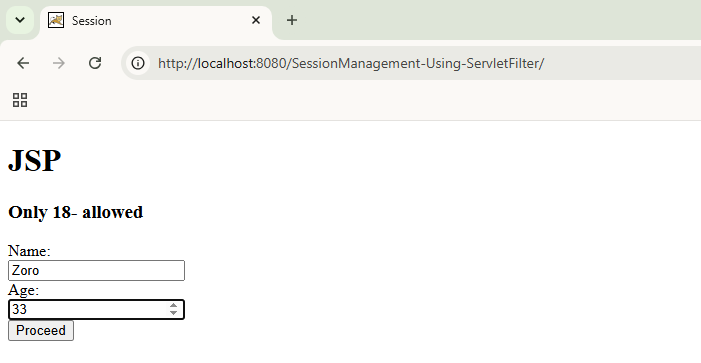
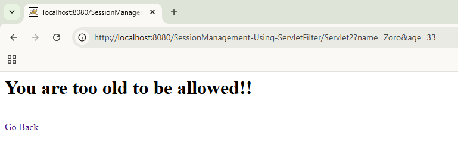
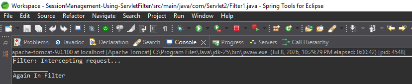
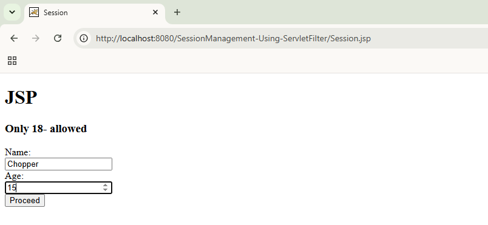
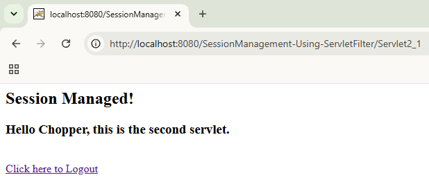
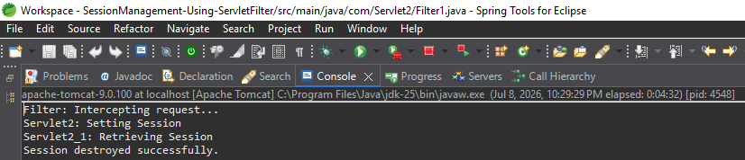
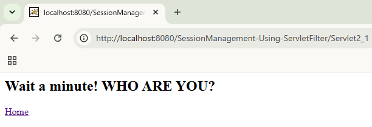

# 🔐 Session Management using Servlet & Filter


A Java web application demonstrating **Servlet Filters**, **HTTP Session Management**, and request processing using **Java Servlets** and **JSP**. The project showcases how filters intercept requests, how session data is maintained across multiple servlets, and how users can securely log out by invalidating the session.

---

## ✨ Features

- Age validation using a Servlet Filter
- Create, retrieve, and invalidate HTTP sessions
- Store and retrieve user data using `HttpSession`
- Request interception before reaching the servlet
- Demonstrates request filtering and client-side redirection
- Secure logout using HttpSession.invalidate()

---

## 🛠️ Tech Stack

| Category | Technology |
|----------|------------|
| Language | Java 8 |
| Backend | Java Servlet 4.0 |
| View Technology | JSP |
| Web Server | Apache Tomcat 9 |
| Concepts | Servlet Filters, HttpSession |
| IDE | Eclipse / Spring Tool Suite (STS) |

---

## 📁 Project Structure

```text
SessionManagement-Using-ServletFilter/
├── src/
│   └── main/
│       ├── java/
│       │   ├── Filter1.java
│       │   ├── Servlet2.java
│       │   ├── Servlet2_1.java
│       │   └── LogoutServlet.java
│       └── webapp/
│           ├── Session.jsp
│           └── WEB-INF/
├── pom.xml
└── README.md
```

---

## 📌 Workflow

1. User enters name and age on the JSP page.
2. The request is intercepted by a Servlet Filter.
3. The filter validates the user's age.
4. If the age is between 1 and 18, the request proceeds to `Servlet2`.
5. `Servlet2` creates an `HttpSession` and stores the user's name.
6. The user is redirected to `Servlet2_1`.
7. `Servlet2_1` retrieves the session attribute and displays the welcome message.
8. `LogoutServlet` invalidates the session and returns the user to the home page.

---

## 🔄 Request Flow

```text
Browser
   │
   ▼
Session.jsp
   │
   ▼
Servlet Filter (Age Validation)
   │
   ├── Invalid Age ── ▶ Error Response
   │
   └── Age 1–18
          │
          ▼
      Servlet2
          │
    Creates HttpSession
          │
          ▼
      Servlet2_1
          │
  Retrieves Session Data
          │
          ▼
    LogoutServlet
          │
  Invalidates Session
          │
          ▼
      Home Page
```

---

## 🧠 Concepts Demonstrated

- Java Servlet Filters
- HTTP Session Management (`HttpSession`)
- Request interception and validation
- Session creation, retrieval, and invalidation
- Request filtering using FilterChain
- Client-side redirection using sendRedirect()
- Share data between servlets using HttpSession

---

## ⚙️ Getting Started

### Prerequisites

- Java 8
- Apache Tomcat 9
- Eclipse or Spring Tool Suite (STS)

### Clone the Repository

```bash
git clone https://github.com/Atharva-Shelke/SessionManagement-Using-ServletFilter.git
```

### Run the Application

1. Import the project into Eclipse or STS as a **Dynamic Web Project**.
2. Configure Apache Tomcat 9 as the target runtime.
3. Right-click the project and select **Run As → Run on Server**.
4. Open the application:

```text
http://localhost:8080/SessionManagement-Using-ServletFilter/
```

---

## 📸 Screenshots

### Home Page



---

### Age Validation



---

### Filter Console Logs



---

### Valid Data Page



---

### Valid Session (Session Managed)



---

### Session Managed Console Logs



---

### Invalid Session



---

## 📚 What I Learned

- Implementing Servlet Filters
- Managing user sessions with `HttpSession`
- Request interception and validation
- FilterChain request processing
- Client-side redirection using sendRedirect()
- Building multi-page Java web applications
- Session invalidation and logout handling
